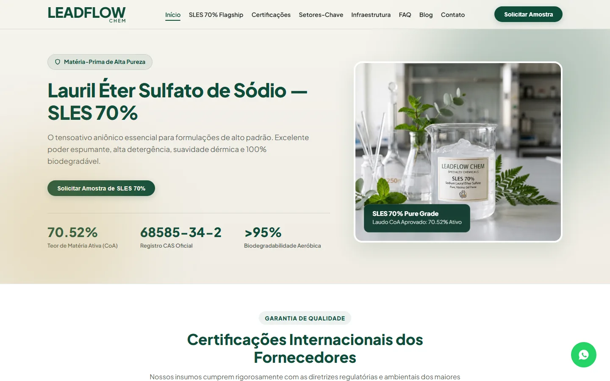
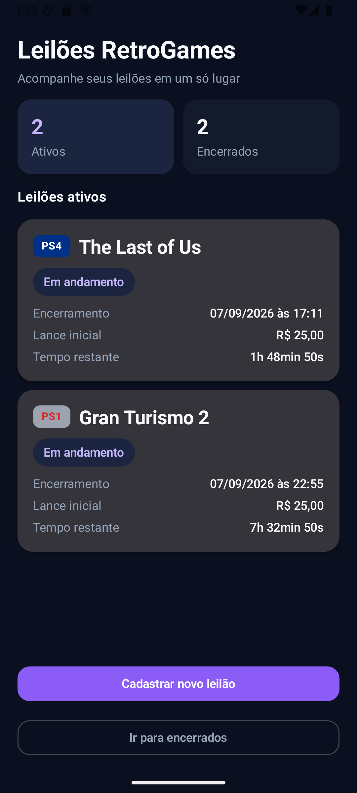
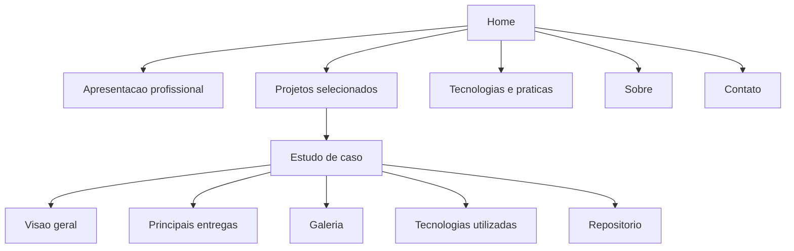

# Portfólio Profissional

<p align="center">
  Portfólio profissional de desenvolvimento de software, reunindo projetos web e Android, estudos de caso e soluções desenvolvidas a partir de necessidades reais.
</p>

<p align="center">
  
  
  
  
  
</p>

## Demonstração visual

### LeadFlow

<p align="center">
  
</p>

### Braga Budget

<p align="center">
  
</p>

### Leilões RetroGames

<p align="center">
  
</p>

### Contas da Casa

<p align="center">
  
</p>

## Sobre o projeto

O **Portfólio Profissional** é uma aplicação web desenvolvida para apresentar projetos, competências técnicas e experiências de desenvolvimento de software de forma organizada, responsiva e acessível.

A aplicação reúne projetos web, sistemas voltados a necessidades reais de negócio e aplicativos Android, apresentando cada trabalho por meio de cards na página inicial e páginas individuais de estudo de caso.

Cada projeto possui contexto próprio, tecnologias utilizadas, principais entregas, galeria de imagens e acesso ao respectivo repositório.

A versão atual foi desenvolvida com React, TypeScript e Vite, com atenção a responsividade, acessibilidade, desempenho, navegação por teclado, testes automatizados e organização do código.

## Principais funcionalidades

### Apresentação profissional

- apresentação principal com resumo da atuação profissional;
- projetos selecionados;
- tecnologias e práticas organizadas por área;
- seção sobre formação e experiência;
- seção de contato;
- links para GitHub e LinkedIn;
- suporte a projetos web e Android.

### Projetos

- cards reutilizáveis na página inicial;
- páginas individuais de estudo de caso;
- roteamento por projeto;
- descrição e contexto de cada solução;
- principais entregas;
- tecnologias utilizadas;
- status atual;
- acesso direto aos respectivos repositórios.

### Galeria

- múltiplas imagens por projeto;
- visualização ampliada em modal;
- navegação entre imagens;
- controles laterais;
- navegação pelas setas do teclado;
- fechamento com `Escape`;
- contenção de foco dentro do modal;
- retorno do foco ao elemento que abriu a imagem.

### Navegação e responsividade

- layout responsivo para desktop, tablet e dispositivos móveis;
- menu específico para telas menores;
- navegação por âncoras na página inicial;
- rotas individuais para os projetos;
- redirecionamento de rotas inválidas para a página inicial;
- gerenciamento de foco ao entrar em páginas de projeto.

## Fluxo da aplicação



## Organização dos projetos

As informações dos projetos são mantidas em uma estrutura de dados centralizada.

```text
Projeto
  |
  +-- titulo
  +-- categoria
  +-- ano
  +-- resumo
  +-- descricao
  +-- imagem
  +-- tecnologias
  +-- principais entregas
  +-- repositorio
  +-- status
        |
        +--> Card na Home
        |
        `--> Pagina individual
```

As galerias também possuem dados próprios centralizados, permitindo adicionar ou alterar imagens sem duplicar a estrutura dos componentes.

## Acessibilidade

A aplicação foi revisada para navegação por teclado e uso com tecnologias assistivas.

Entre os recursos implementados estão:

- skip link para acesso direto ao conteúdo principal;
- estados de foco visíveis;
- navegação completa por teclado;
- gerenciamento de foco ao acessar páginas internas;
- focus trap dentro do modal da galeria;
- fechamento da galeria com `Escape`;
- navegação pelas setas do teclado;
- restauração do foco ao fechar o modal;
- textos alternativos nas imagens;
- indicação para leitores de tela em links que abrem nova aba;
- uso de atributos ARIA quando necessários;
- suporte a `prefers-reduced-motion`;
- contraste de textos revisado.

## Desempenho

O projeto passou por uma etapa específica de otimização dos arquivos distribuídos.

Entre os ajustes realizados estão:

- conversão das principais imagens do LeadFlow de PNG para WebP;
- preservação da resolução original das imagens otimizadas;
- carregamento somente dos subconjuntos Latin das fontes;
- uso local de Manrope Variable e JetBrains Mono Variable;
- build de produção otimizado pelo Vite.

Após as otimizações, o tamanho total do build foi reduzido de aproximadamente:

```text
3,96 MB
   |
   v
2,05 MB
```

A redução representa aproximadamente 48% do tamanho total do build.

## Tecnologias

| Camada | Tecnologias |
|---|---|
| Interface | React 19, TypeScript |
| Roteamento | React Router |
| Estilos | CSS3 |
| Build | Vite 8 |
| Tipografia | Manrope Variable, JetBrains Mono Variable |
| Testes | Vitest, Testing Library, jsdom |
| Qualidade | ESLint |
| Acessibilidade | HTML semântico, ARIA, navegação por teclado |
| Performance | WebP, fontes locais otimizadas |
| Versionamento | Git, GitHub |
| Documentação | Markdown |

## Estrutura principal

```text
portfolio-profissional/
|
|-- public/
|   |-- images/
|   |   |-- profile/
|   |   `-- projects/
|   `-- favicon.svg
|
|-- src/
|   |-- components/
|   |-- data/
|   |-- pages/
|   |-- test/
|   |-- App.tsx
|   |-- App.css
|   |-- fonts.css
|   |-- index.css
|   `-- main.tsx
|
|-- eslint.config.js
|-- index.html
|-- package-lock.json
|-- package.json
|-- tsconfig.app.json
|-- tsconfig.json
|-- tsconfig.node.json
|-- vite.config.ts
|-- vitest.config.ts
`-- README.md
```

## Execução local

### Requisitos

- Node.js;
- npm;
- navegador moderno.

### Instalação

Instale as dependências:

```powershell
npm install
```

Execute o ambiente de desenvolvimento:

```powershell
npm run dev
```

O Vite disponibiliza a aplicação localmente em um endereço semelhante a:

```text
http://localhost:5173
```

### Build

Gere a versão de produção:

```powershell
npm run build
```

Para visualizar o build localmente:

```powershell
npm run preview
```

## Testes e qualidade

A versão atual possui uma suíte automatizada com:

```text
4 arquivos de teste
20 testes automatizados
20 testes aprovados
```

Os testes cobrem:

- cards dos projetos;
- conteúdo principal da Home;
- menu mobile;
- skip link;
- listagem dos projetos;
- páginas individuais;
- rotas inválidas;
- título das páginas;
- gerenciamento de foco;
- abertura e fechamento da galeria;
- navegação por teclado;
- restauração e contenção de foco no modal.

Execute a suíte automatizada:

```powershell
npm test
```

Execute a análise estática:

```powershell
npm run lint
```

Gere e valide o build de produção:

```powershell
npm run build
```

O desenvolvimento utiliza Git com commits incrementais e validações de testes, lint e build antes da consolidação das principais etapas.

## Segurança e privacidade

- o portfólio não depende de credenciais ou segredos para execução;
- informações privadas de clientes não são utilizadas na apresentação pública;
- projetos white-label preservam dados que não devem ser expostos;
- screenshots públicos devem utilizar somente informações adequadas para divulgação;
- links externos que abrem novas abas utilizam proteção de referência;
- o portfólio não possui autenticação;
- o portfólio não possui armazenamento próprio de dados pessoais;
- o portfólio não possui backend próprio.

## Status

A versão atual está funcional, responsiva, acessível e coberta por testes automatizados.

As etapas de estruturação visual, responsividade, acessibilidade, testes automatizados e otimização de carregamento foram concluídas.

A publicação pública e os ajustes finais de distribuição permanecem como próximas etapas do projeto.

## Autor

**Diogo Zarpelão**

Desenvolvimento frontend, arquitetura da interface, experiência responsiva, acessibilidade, testes automatizados, otimização de desempenho e documentação técnica.

GitHub: [@diogozarpelo](https://github.com/diogozarpelo)

## Uso

Este repositório é apresentado para fins de estudo, demonstração técnica e portfólio profissional.

Todos os direitos reservados.
